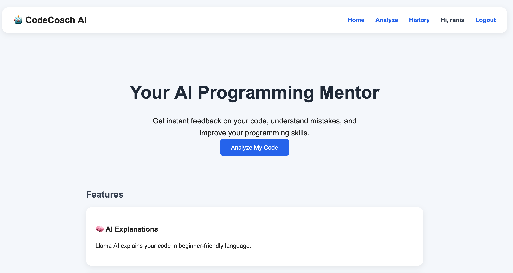
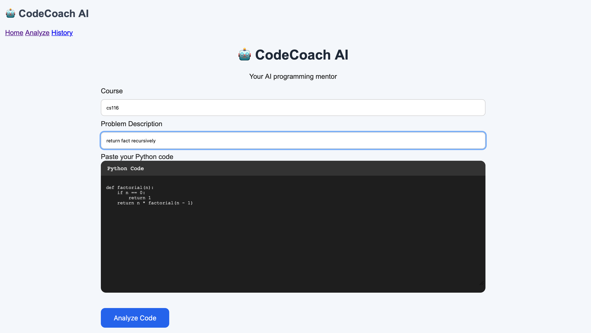
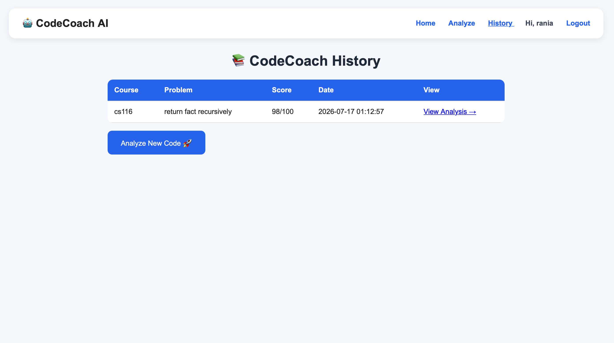

# 🤖 CodeCoach AI

An AI-powered code review platform that helps beginner programmers improve their Python code through automated feedback, scoring, and personalized explanations.

🌐 **Live Demo:** https://codecoachai.onrender.com

---

## 📖 Overview

CodeCoach AI analyzes Python programs using a combination of:

- Rule-based static analysis
- AI-generated explanations (powered locally by Ollama)
- Code quality scoring
- Personalized learning suggestions

The goal is to help students understand **why** their code can be improved—not just whether it works.

The deployed version demonstrates the application's interface and rule-based analysis. The full AI tutoring experience is available when running the project locally with Ollama.

---
## 📸 Screenshots

### 🏠 Home



---

### 💻 Analyze Code



---

### 📊 Results


---

### 📚 History



## ✨ Features

- 🤖 AI-generated code explanations
- 📌 Rule-based bug detection
- 📊 Code quality score (0–100)
- 📚 Personalized learning tips
- 💻 Side-by-side code comparison
- 📝 Submission history
- 🔐 User authentication
- 🌐 Public web deployment with Render

---

## 🛠 Tech Stack

### Backend

- Python
- Flask
- SQLite

### AI

- Ollama
- Llama 3.2

### Frontend

- HTML
- CSS
- Jinja2

### Tools

- Git
- GitHub
- Render
- Pytest

---

## 📂 Project Structure

```text
CodeCoachAI/
│
├── app.py
├── requirements.txt
├── README.md
│
├── services/
│   ├── analyzer.py
│   └── ai_service.py
│
├── templates/
│
├── static/
│
├── tests/
│
└── screenshots/
```

---

## 🚀 Running Locally

Clone the repository:

```bash
git clone https://github.com/Raniafsl/CodeCoachAI.git
cd CodeCoachAI
```

Create a virtual environment:

```bash
python3 -m venv .venv
source .venv/bin/activate
```

Install dependencies:

```bash
pip install -r requirements.txt
```

Install and start Ollama.

Pull the model:

```bash
ollama pull llama3.2:3b
```

Start Ollama:

```bash
ollama serve
```

Run the application:

```bash
python app.py
```

Open:

```
http://127.0.0.1:5000
```

---

## 🧪 Testing

Run the unit tests:

```bash
pytest
```

---

## 🌐 Deployment

The application is deployed using **Render**.

The public deployment demonstrates the user interface and rule-based analysis.

The complete AI tutoring functionality is available when running the application locally with Ollama.

---

## 📈 Future Improvements

- Support multiple programming languages
- Richer static code analysis
- PostgreSQL database
- Docker support
- Cloud-hosted AI backend
- Instructor dashboard
- Syntax highlighting in the editor

---

## 👩‍💻 Author

**Rania Faisal**

Computer Science Student  
University of Waterloo

GitHub:
https://github.com/Raniafsl